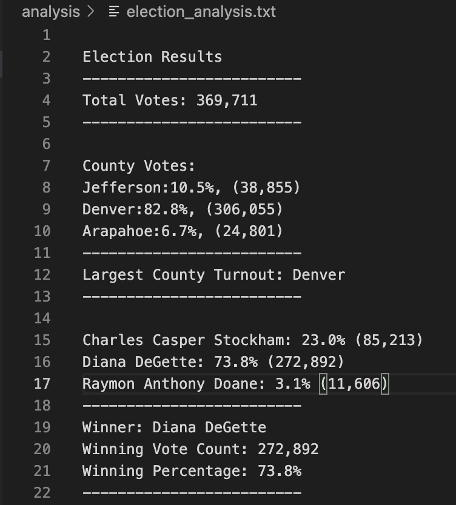

# Election-Analysis

## Project Overview
A Colorado Board of Elections employee has given the following tasks to complete the election audit of a recent local congressional election.

1. Calculate the total number of votes cast.
2. Get a complete list of candidates who received votes.
3. Calculate the total number of votes each candidate received.
4. Calculate the percentage of votes each candidate won.
5. Determine the winner of the election based on popular vote.

## Resources
- Data Source: election_recult.csv
- Software: Python 3.6.1, Visual Studio Code, 1.38.1

## Election Audit Results
 
The analysis of the election show that:
- There were "369,711" votes cast in the election.

- The county result were:
   - Jefferson received "10.5%" of the vote and "38,855" number of votes.
   - Denver received "82.8%" of the vote and "306,055" number of votes.
   - Arapahoe received "6.7%" of the vote and "24,801" number of votes. 
- The largest numver of votes was:
   -  Denver with "82.8%" of vote and "306,055" number of votes.

- The candidate result were: 
   - Candidate 1 Charles Casper Stockham received "23.0%" of the vote and "85,213" number of votes.
   - Candidate 2 Diana DeGette received "73.8%" of the vote and "272,892" number of votes.
   - Candidate 3 Raymon Anthony Doane received "3.1%" of the vote and "11,606" number of votes.
- The winner of the election was:
  - Candidate 2 Diana DeGette, who received "73.8%" of the vote and "306,055" number of votes.

## Challenge Summary
Business proposal to the election commission on how this script can be used—with some modifications—for any election.
   - This script can be modified for other election to analysis the result by editing the following
      - Line 9 or 11 : Substitute new data path or export result in different file
      </code>
     
                 file_to_load = os.path.join("Resources", "newdata.csv") 
                 file_to_save = os.path.join("analysis", "newresult.txt")
      </code>
      
      - Line 49 or 52 : Redirect row[ ], if data header is not line up as 0:Ballot ID, 1:County, 2:Candidate
      </code>
        
        
                  candidate_name = row[2]
                  county_name = row[1]
         
      </code>
               
  

